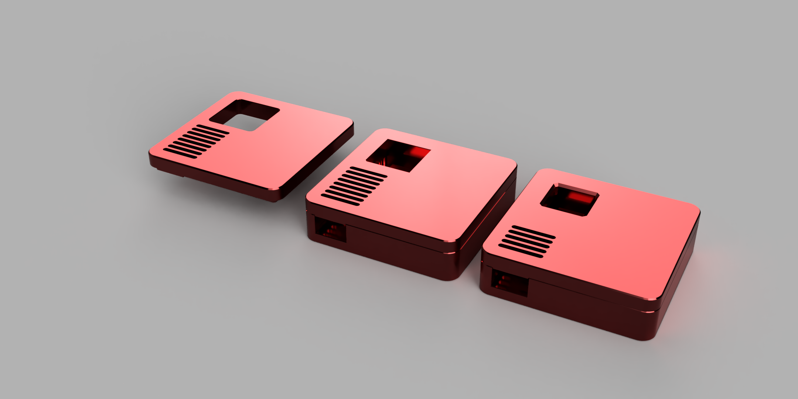
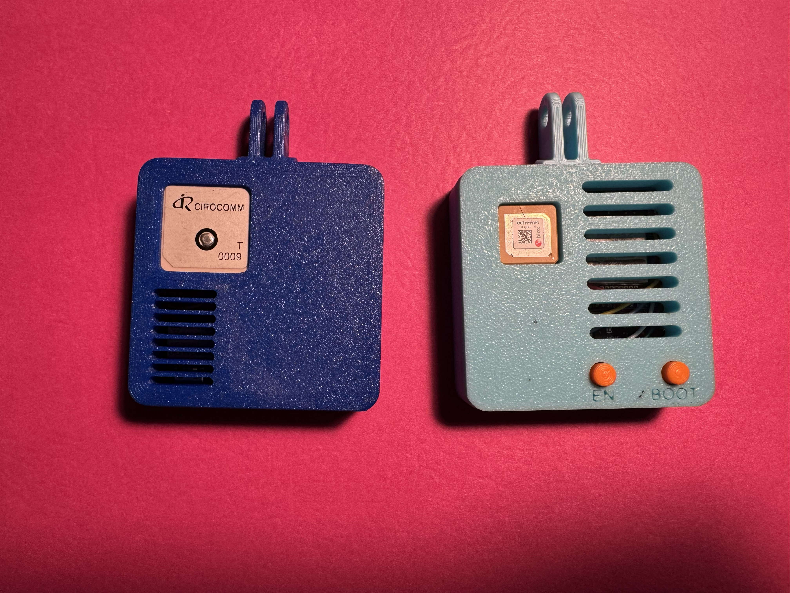
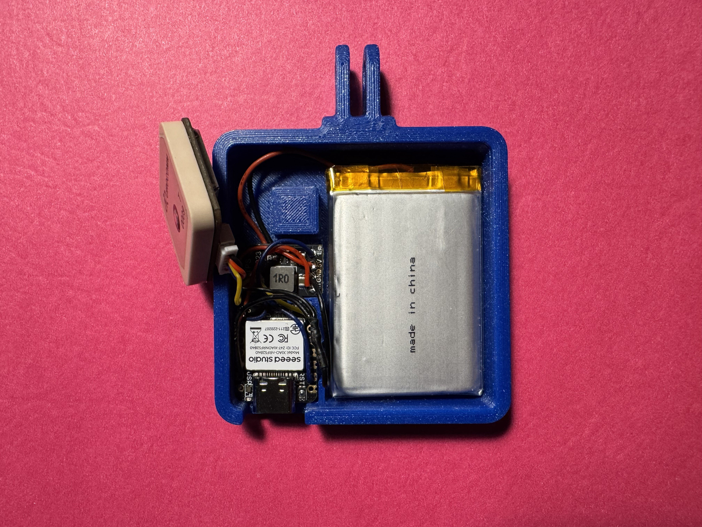

# RaceBox Mini Emulator - Battery Version

## Overview

This is the battery-powered version of the RaceBox Mini Emulator, built around the **Seeed Studio XIAO nRF52840 Sense**. It retains the high-performance 25Hz GNSS capabilities of the original while adding native battery management, lower power consumption, and a more compact form factor.

This version leverages the **onboard LSM6DS3 IMU** of the XIAO nRF52840 Sense, eliminating the need for an external accelerometer/gyroscope module.



### Assembled Unit


---

## Features

- **25Hz GNSS Data**: High-precision positioning using U-blox GNSS modules.
- **Integrated IMU**: Uses the onboard 6-axis IMU (LSM6DS3) of the XIAO Sense.
- **Battery Powered**: Integrated battery charging and monitoring.
- **Compact Design**: Fits a standard LiPo battery (max 6.9mm x 54mm x 34mm).
- **Efficient Power**: Uses a TPS61023 boost converter for stable GNSS power.
- **BLE Streaming**: Same custom RaceBox protocol as the original.

## Bill of Materials (BOM)

- **Microcontroller**: [Seeed Studio XIAO nRF52840 Sense](https://www.digikey.com/en/products/detail/seeed-technology-co-ltd/102010469/16652896)
- **GNSS Module**: *All original modules are supported.*
- **Power Management**: [TPS61023 Boost Converter](https://www.digikey.com/en/products/detail/adafruit-industries-llc/4654/12697636) (or similar 3.3V-to-5V/Adjustable boost module)
- **M3x4 Screw** (1)    
- **Battery**: 1S LiPo Battery.
    - **Max Dimensions**: 6.9mm (H) x 54mm (L) x 34mm (W)
- **3D Printed Case**: Files located in `STL/` or `CAD/`.
- **Wires & Soldering Supplies**

---

## Assembly & Wiring

### Power Wiring
The GNSS module is powered via the TPS61023 boost converter to ensure stable voltage/current from the XIAO's regulated rail.



1.  **XIAO 3.3V** -> **TPS61023 VIN**
2.  **XIAO GND** -> **TPS61023 GND**
3.  **TPS61023 VOUT** -> **GNSS VCC**

### GNSS Data Wiring
- **XIAO D6 (TX)** -> **GNSS RX**
- **XIAO D7 (RX)** -> **GNSS TX**
- **XIAO GND** -> **GNSS GND**
- **XIAO D1** -> **TPS61023 EN**

### Alternative Wiring (Matek SAM-M10Q)
If using the **Matek SAM-M10Q** (which supports 3.3V), you can improve efficiency by using **low-side switching** instead of the boost converter.

**Components Needed:**
- 1x 2N2222 NPN Transistor
- 1x 1kΩ Resistor

**Wiring:**
1.  **XIAO 3.3V** -> **GNSS VCC**
2.  **GNSS GND** -> **2N2222 Collector**
3.  **2N2222 Emitter** -> **XIAO GND**
4.  **XIAO D1** -> **1kΩ Resistor** -> **2N2222 Base**

*Note: The Onboard IMU relies on internal connections, so no external wiring is needed for the accelerometer/gyroscope.*

---

## Firmware Setup

The firmware is located in the `Code/nRF52840_racebox_mini_emulator` directory.

### 1. Install Board Support
1.  Open Arduino IDE Preferences.
2.  Add `https://files.seeedstudio.com/arduino/package_seeeduino_boards_index.json` to "Additional Board Manager URLs".
3.  Go to **Tools > Board > Boards Manager**.
4.  Search for "Seeed nRF52" and install **Seeed nRF52 Boards**.
5.  Select **Seeed XIAO nRF52840 Sense** as your board.

### 2. Install Libraries
Install the following libraries via the Arduino Library Manager:
- **Seeed Arduino LSM6DS3** (for the onboard IMU)
- **SparkFun u-blox GNSS Arduino Library** (Version 2.x)
- **Adafruit TinyUSB**

### 3. Upload
**Note**: The firmware defaults to **Light Sleep** ("Always On") behavior for instant discoverability.

1.  Open `Code/nRF52840_racebox_mini_emulator_always_on/nRF52840_racebox_mini_emulator_always_on.ino`.
2.  Connect the XIAO via USB-C.
3.  Select the correct Port.
4.  Click **Upload**.

---

## Customization

You can customize the firmware by modifying the `#define` lines at the top of the `.ino` file:

### 1. GNSS Constellations
Select which satellite systems to use. More systems = faster/better fix but slightly higher power usage.
```cpp
#define ENABLE_GNSS_GPS      // Always keep GPS enable
#define ENABLE_GNSS_GALILEO  // Recommended for best performance
// #define ENABLE_GNSS_GLONASS // Optional
// #define ENABLE_GNSS_BEIDOU  // Optional
```

### 2. Device Name
Personalize the BLE broadcast name (keep the "RaceBox Mini " prefix).
```cpp
#define SERIAL_NUM "0123456789" // The unique 10-digit serial
```

### 3. Sleep Timeout
Adjust how long the device waits before entering Light sleep after disconnection (default: 10 minutes).
```cpp
#define GPS_HOT_TIMEOUT_MS 600000 // 10 Minutes (Stay powered after disconnect)
```

### 4. Charging Behavior
Configure whether the device sleeps or stays active while charging.
```cpp
#define SLEEP_WHILE_CHARGING true // true = Efficiency (Sleeps), false = Performance (Always Active)
```


## Power Consumption & Runtime
Tested with this **[1100mAh LiPo Battery](https://a.co/d/hiqOe05)**:

- **Active Mode**: ~14 Hours (Observed)
  - *Current Draw*: 50-80mA (dependent on GNSS Constellations and Signal)
- **Light Sleep** (BLE Advertizing, GNSS Off): ~0.30mA (300µA)
  - Available in 'Always On' firmware / Configurable.
  - Default behavior for Battery Version.
- **Deep Sleep** (System OFF, Wake-on-Shake): < 10µA
  - *Theoretical Shelf Life*: >1 Year.

> [!NOTE]
> **LiPo Battery Caveats**:
> While the theoretical sleep runtime is years, real-world battery life is limited by:
> 1.  **Self-Discharge**: LiPo batteries lose ~2-5% of their charge per month even when disconnected.
> 2.  **Protection Circuit**: The battery's internal BMS consumes a small amount of power (2-10µA).
> 3.  **Temperature**: Extreme cold or heat significantly reduces effective capacity.
> 
> *Expect practically ~6-12 months of standby time in Deep Sleep.*

---

## Power Modes & Wake Functionality

This device supports two power-saving modes depending on the Configuration in the `.ino` file.

### 1. Light Sleep (Default Configuration)
**Behavior**: GNSS and IMU are powered down, but **BLE Advertising continues** (at a slower Eco rate).
**Usage**: Recommended for most users. Ensures the device is always discoverable and ready to connect instantly.
**Power**: ~0.3mA (300µA) — Still very low power consumption for daily usage (months of standby).
**Trigger**:
- Occurs after GPS Hot Timeout after BLE disconnection. (default 10 minutes)

### 2. Deep Sleep (Optional Configuration)
**Behavior**: The device turns OFF completely (No BLE, No GNSS).
**Usage**: For extreme long-term storage where no BLE broadcast is desired.
**Configuration**:
- Enable by setting `#define ENABLE_DEEP_SLEEP true` in the firmware.
- Adjust `DEEP_SLEEP_DAYS` (default: 1 day) to automatically enter Deep Sleep after extended inactivity.
  
**Wake-Up**:
- **Shake-to-Wake**: The onboard accelerometer detects motion/taps and instantly wakes the device.
- **Plug-to-Wake**: Connecting USB power will also wake the device.

---

## Usage

1.  Power on the device (switch or battery plug).
2.  The Blue LED on the XIAO will indicate BLE Connection (named "RaceBox Mini 0123456789" by default).
3.  Connect using a compatible app (RaceChrono, SoloStorm, etc.).
4.  **Charging**: The XIAO handles charging automatically when USB is connected. The green charge LED on the XIAO will light up while charging.
    - **Rate**: Fixed at **100mA**. Charging a dead 1100mAh battery takes ~11-12 hours due to losses.
    - **Power Path**: The Seeed XIAO nRF52840 Sense is optimized to allow running the module at full performance *and* charging at max speed simultaneously from a standard USB port.
5.  The Red and Green LED on the XIAO will indicate the Fix Status of the GNSS Module.
    - Red: No Fix
    - Green: 3D Fix
    - Yellow: 2D Fix

---