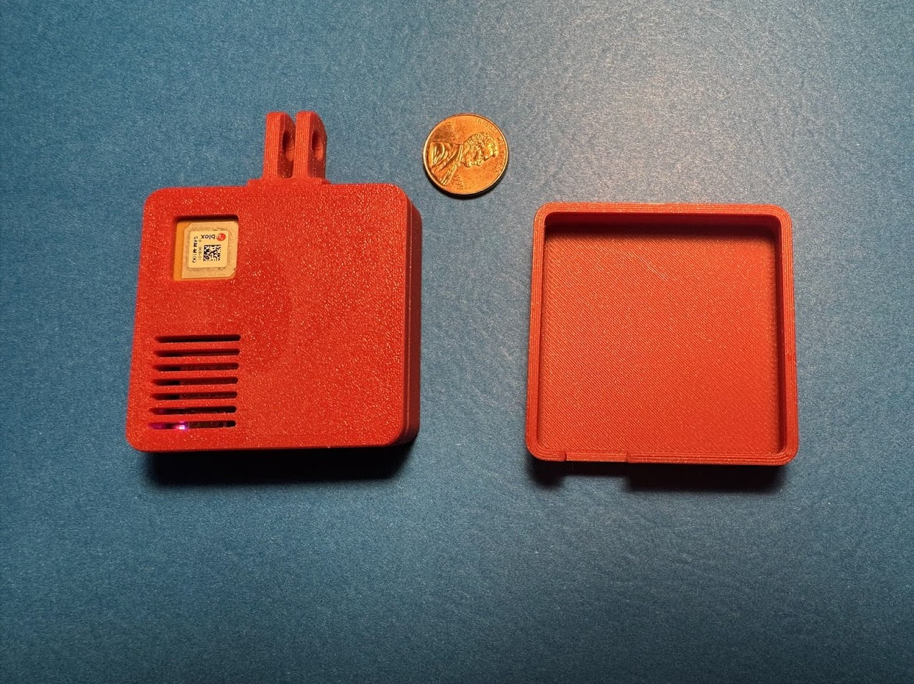
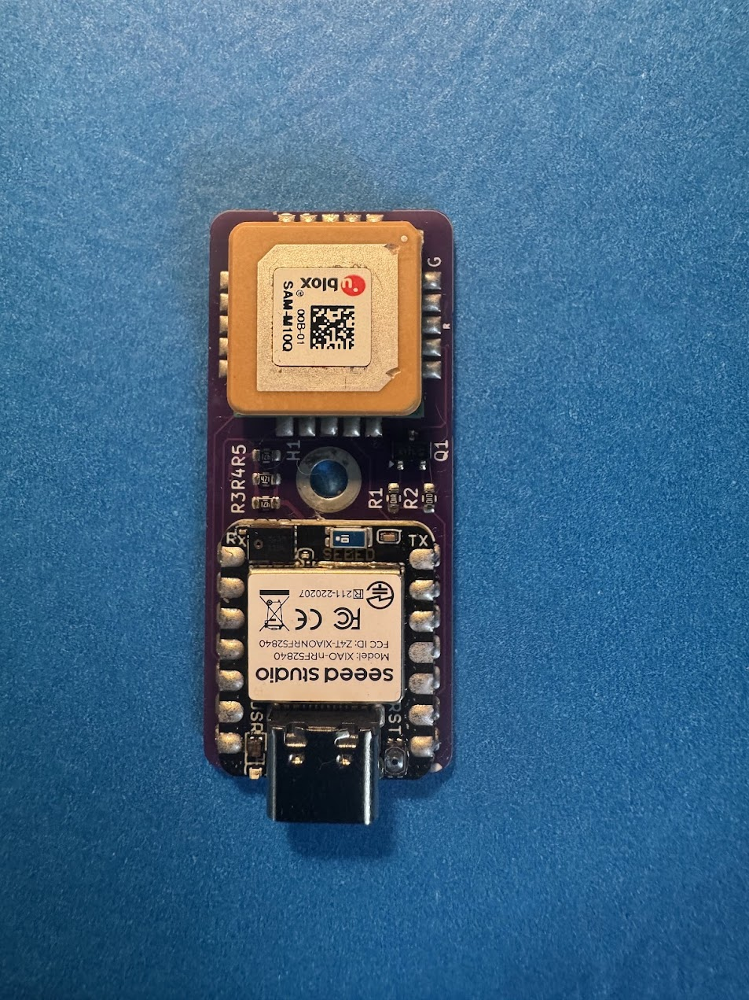
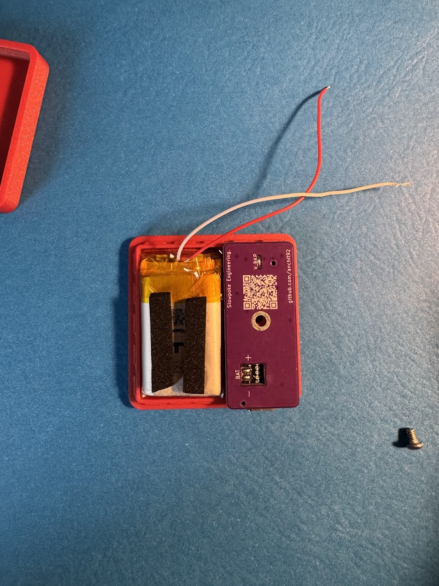

# RaceBox Mini Emulator - Custom PCB Version

[← Back to Main Repository](../../../)

## Overview


An open-source custom PCB and firmware project for a low-power, high-performance RaceBox Mini Emulator. 

**Why this version?** I created this custom PCB to learn PCB design, while standardizing on a single, reliable GNSS module (u-blox SAM-M10Q) and IMU (LSM6DS3) for better optimization and consistency across builds.

---

## Features

- **25Hz GNSS Data**: High-precision positioning using the u-blox SAM-M10Q module.
- **Integrated IMU**: Uses the onboard 6-axis IMU (LSM6DS3) of the XIAO Sense for "Shake-to-Wake" functionality.
- **Battery Powered**: Integrated battery charging and monitoring natively supported by the XIAO.
- **Ultra-Low Power Optimization**: Refined sleep modes achieving a ~40µA deep sleep baseline.
- **BLE Streaming**: Emulates the custom RaceBox protocol identically.
- **Custom PCB Integration**: Minimizes wiring and footprint size for a clean, stable build.

---

## Bill of Materials (BOM)

- **Microcontroller**: [Seeed Studio XIAO nRF52840 Sense](https://www.digikey.com/en/products/detail/seeed-technology-co-ltd/102010469/16652896)
- **GNSS Module**: [u-blox SAM-M10Q-00B](https://www.digikey.com/en/products/detail/u-blox/SAM-M10Q-00B/16672678)
- **Battery**: [1S 400mAh LiPo Battery](https://www.digikey.com/en/products/detail/adafruit-industries-llc/3898/9685336)
  - *Alternatively*, any LiPo battery up to 10mm tall, 25mm wide, and 40mm long should fit in the space in the case. (e.g., [Amazon Option](https://www.amazon.com/dp/B09F9VK77V?ref=ppx_yo2ov_dt_b_fed_asin_title))
- **PCB**: [JLCPCB](https://www.jlcpcb.com/)
- **M3 Screw**: 1x M3 BHCS 4-6mm (for the pcb)
- **3D Printed Case**: Custom 3D printed case compatible with the PCB footprint.(you can get these manufactured at jlcpcb too, but I haven't tried that service from them)

Approximate Cost : $60

---

## PCB Manufacture

Use the fabrication files in `PCB_files/seeed_studio_GNSS/jlcpcb/production_files/` to order your assembled boards. 
- **Assembly Type**: Order all of them with assembly on the **top side only** (the cost to do 2 or 5 is basically the same so dont bother skimping out).
- **Files**: The BOM file and the CPL file are included in the production files folder. 
- *Note: It should cost something like $7 shipped for 5 boards. If the fabrication app quotes something like $40, it may be bugged—try refreshing or re-uploading the files.*

---

## Assembly & Wiring
If you order your PCB with JLCPCB SMT Assembly, note that having them include and solder the SAM-M10Q GNSS module is far too expensive. 

Therefore, **the board is specifically designed so that you can easily solder the GNSS module by hand**. You will need to:
1. Solder the **u-blox SAM-M10Q** GNSS module onto its designated footprint on the PCB.
2. Solder the **Seeed Studio XIAO nRF52840 Sense** directly to the designated pads on the PCB using castellated mounting.

3. Solder the LiPo battery to the battery pads on the bottom of the XIAO.
4. Secure the battery to the case with double-sided tape/ foam strip to prevent it from rattling around and snap the assembly together.

---

## Firmware Setup

### 1. Install Board Support
1.  Open Arduino IDE Preferences.
2.  Add `https://files.seeedstudio.com/arduino/package_seeeduino_boards_index.json` to "Additional Board Manager URLs".
3.  Go to **Tools > Board > Boards Manager**.
4.  Search for "Seeed nRF52" and install **Seeed nRF52 Boards**.
5.  Select **Seeed XIAO nRF52840 Sense** as your board.

### 2. Install Libraries
Install the following libraries via the Arduino Library Manager:
- **Seeed Arduino LSM6DS3** (for the onboard IMU)
- **SparkFun u-blox GNSS Arduino Library** (Version 2.x)
- **Adafruit TinyUSB**

### 3. Upload
1. **Confirm Soldering of SAM-M10Q**: After soldering the SAM-M10Q to the PCB, confirm that it is properly connected by loading the `GNSS_Debug_Passthrough/` sketch and checking for the output of NMEA sentences on the serial monitor.
2. **Burn OTP Settings**: Flash the `Code/M10_OTP_Burner/M10_OTP_Burner.ino` sketch to the nRF52840 to write the precise configurations to the SAM-M10Q (required for persistent 115200 baud communication across hardware reboots without battery backup and high performance mode for 25hz GNSS data).
3. **Flash Main Firmware**: Open `Code/nRF52840_racebox_mini_emulator_always_on/nRF52840_racebox_mini_emulator_always_on.ino` and upload it to your board to begin using it.
   - *Hardware Note:* The software logic natively handles the custom PCB requirements, such as inverse logic for the `GPS_EN_PIN` (pull LOW to enable) and optimal deep-power-down states. Ensure `#define PCB_VERSION` is uncommented in the `.ino` file if using this specific PCB.

---

## Customization

You can customize the firmware by modifying the `#define` lines at the top of the `.ino` file:

### 1. GNSS Constellations
Select which satellite systems to use. More systems = faster/better fix but slightly higher power usage and lower Refresh Rate.
```cpp
#define ENABLE_GNSS_GPS      // Always keep GPS enable
#define ENABLE_GNSS_GALILEO  // Recommended for best performance
// #define ENABLE_GNSS_GLONASS // Optional
// #define ENABLE_GNSS_BEIDOU  // Optional
```

### 2. Device Name
Personalize the BLE broadcast name (keep the "RaceBox Mini " prefix).
```cpp
#define SERIAL_NUM "0123456789" // The unique 10-digit serial
```

### 3. Sleep Timeout
Adjust how long the device waits before entering Light sleep after disconnection (default: 10 minutes).
```cpp
#define GPS_HOT_TIMEOUT_MS 900000 // 15 Minutes (Stay powered after disconnect)
```

### 4. Charging Behavior
Configure whether the device sleeps or stays active while charging.
```cpp
#define SLEEP_WHILE_CHARGING true // true = Efficiency (Sleeps), false = Performance (Always Active)
```

---

## Power Consumption & Runtime

- **Active Mode**: ~20mA - 40mA depending on fix / constellations.
- **Light Sleep** (BLE Advertising, GNSS Off): ~50µA
  - Available in 'Always On' firmware / Configurable.
  - Default behavior for the PCB Version.
- **Deep Sleep** (System OFF, Wake-on-Shake): ~10µA - 40µA
  - *Theoretical Shelf Life*: >1 Year.

> [!NOTE]
> **LiPo Battery Caveats**:
> While the theoretical sleep runtime is years, real-world battery life is limited by:
> 1.  **Self-Discharge**: LiPo batteries lose ~2-5% of their charge per month even when disconnected.
> 2.  **Protection Circuit**: The battery's internal BMS consumes a small amount of power (2-10µA).
> 3.  **Temperature**: Extreme cold or heat significantly reduces effective capacity.
> 
> *Expect practically ~6-12 months of standby time in Deep Sleep.*

---

## Power Modes & Wake Functionality

This device supports two power-saving modes depending on the Configuration in the `.ino` file.

### 1. Light Sleep (Default Configuration)
**Behavior**: GNSS and IMU are powered down, but **BLE Advertising continues** (at a slower Eco rate).
**Usage**: Recommended for most users. Ensures the device is always discoverable and ready to connect instantly.
**Power**: ~50µA — Low power consumption for daily usage (months of standby).

**Trigger**:
- Occurs after GPS Hot Timeout after BLE disconnection. (default 15 minutes)

### 2. Deep Sleep (Optional Configuration)
**Behavior**: The device turns OFF completely (No BLE, No GNSS).
**Usage**: For extreme long-term storage where no BLE broadcast is desired.
**Configuration**:
- Enable by setting `#define ENABLE_DEEP_SLEEP true` in the firmware.
- Adjust `DEEP_SLEEP_DAYS` (default: 1 day) to automatically enter Deep Sleep after extended inactivity.
  
**Wake-Up**:
- **Shake-to-Wake**: The onboard accelerometer detects motion/taps and instantly wakes the device.
- **Plug-to-Wake**: Connecting USB power will also wake the device.

---

## Usage

1.  If using a battery it should always be powered on, If it in deep sleep, shake to to wake it up.
2.  The Blue LED on the XIAO will indicate BLE Connection (named "RaceBox Mini 0123456789" by default).
3.  Connect using a compatible app (RaceChrono, SoloStorm, etc.).
4.  **Charging**: The XIAO handles charging automatically when USB is connected. The green charge LED on the XIAO will light up while charging.
    - **Rate**: Fixed at **100mA**. Charging a dead 400mAh battery takes ~4-5 hours.
5.  The Red and Green LED on the XIAO will indicate the Fix Status of the GNSS Module.
    - Red: No Fix
    - Green: 3D Fix
    - Yellow: 2D Fix
