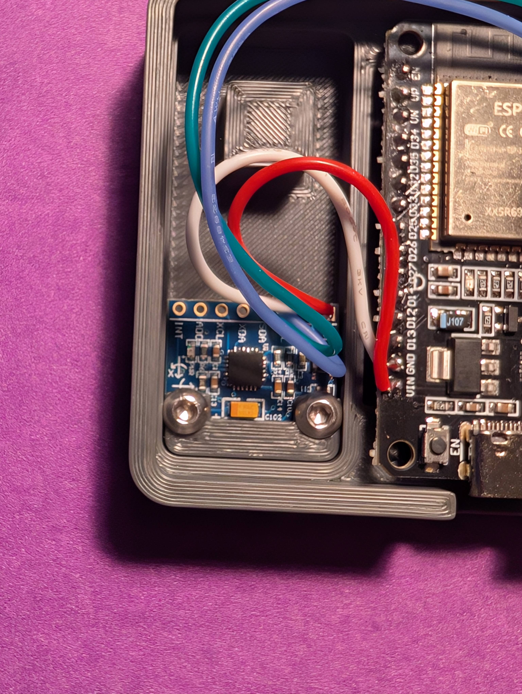

# Open Source RaceBox Mini Emulator

## Overview

This project provides firmware for an ESP32-based device that acts as a high-performance GPS/IMU  Bluetooth Low Energy (BLE) broadcaster. It integrates a U-blox GNSS module for precise position, velocity, and timing data at 25Hz, along with an MPU6050 accelerometer and gyroscope for motion sensing. All collected data is streamed over BLE, making it ideal for applications like vehicle performance analysis, lap timing, or real-time telemetry.

The device is designed to be housed in a custom 3D-printed enclosure, with design files included in this repository.

---

## Features

- **High-Resolution GPS Data**: Achieves 25Hz update rate using a U-blox GNSS module.  
- **Multi-Constellation Support**: Leverages GPS, Galileo, GLONASS, and BeiDou for enhanced accuracy and reliability.  
- **Integrated IMU**: Captures 3-axis accelerometer (`±8g`) and 3-axis gyroscope (`±500 deg/s`) data from the MPU6050.  
- **Real-time BLE Streaming**: Transmits a custom 88-byte data packet containing comprehensive GNSS and IMU information over BLE.  
- **Automatic Configuration**: Robust GPS initialization.
- **Custom RaceBox Protocol**: Data is encapsulated in a UBX-like custom protocol for efficient transmission.  
- **3D Printable Enclosure**: Includes design files for a compact and protective case.  

---

## Bill of Materials (BOM)

To build this project, you'll need the following components:

- **ESP32 Development Board**: (https://a.co/d/fTThpTl)  
- **U-blox GNSS Module**: (https://a.co/d/b6DcUS6 or https://a.co/d/54zrba3)
- **MPU6050 Accelerometer/Gyroscope Module**: (https://a.co/d/dCMwffg or similar)  
- **24AWG Hook-up Wire/Jumper Wires** or just use the wiring that comes with GNSS module, its perfect for this application.
- **M3x6 Screws** (2)    
- **Soldering Iron & Solder**
- **USB-C or Micro-USB Cable** (Depending on your ESP32 board, But USB-C all the things)  
- **3D Printer & ABS Filament**  

The electronics should cost under 40$. 

### Notes on GNSS Module Options

Both GNSS modules listed above perform nearly identically in terms of signal acquisition and accuracy. The \~\$20 module ([link](https://a.co/d/b6DcUS6)) has a ceramic antenna that’s roughly twice the size of the one on the \~\$40 module ([link](https://a.co/d/54zrba3)), and it *feels* like it connects faster during casual use.

However, in repeated side-by-side testing from a cold start, both modules consistently acquire a signal at the same rate. I’ve tested this about ten times, and the results have been indistinguishable, I've given up on trying to measure the difference.

The main measurable difference is power consumption:

* With the **\$20 module** the project draws approximately **0.14 A** during operation
* With the **\$40 module** the project draws approximately **0.11 A** during operation

I personally keep the \$20 one in my autocross backpack, mostly due to the antenna size and subjective performance. That said, the \$20 version uses an older chipset. While it’s still reliable and performs well, I’m unsure how long it will remain available or supported—which is why I’ve included both options here.

I noticed that the original GPS is unavailable at amazon, theoretically this one should work- https://a.co/d/bNwME7S but be warned that its currently untested and theres no lid for it.
---

## Assembly Instructions

### Wire the Components, load the firmware and test them outdoors.

**ESP32 <--> U-blox GNSS Module:**
- ESP32 GPIO 16 (RX2) <--> GNSS TX  
- ESP32 GPIO 17 (TX2) <--> GNSS RX  
- ESP32 5V or 3.3V <--> GNSS VCC *(check voltage requirements)*  
- ESP32 GND <--> GNSS GND  

**ESP32 <--> MPU6050:**
- ESP32 GPIO 21 (SDA) <--> MPU6050 SDA  
- ESP32 GPIO 22 (SCL) <--> MPU6050 SCL  
- ESP32 5V or 3.3V <--> MPU6050 VCC *(check voltage requirements)*
- ESP32 GND <--> MPU6050 GND  

---

### Prepare the 3D Printed Case

- You shouldn't need any post processing of the printed parts but make sure the buttons slide smoothly in the holes in the lid

### Enclose the Electronics

- Mount the MPU6050 module using M3 screws

- Place the ESP32 in the slot  
- Route cables neatly

- Close the case carefully, it should click together. Make sure none of the wires are pinched or in the way of the buttons

---

## Firmware Setup and Upload

### 1. Install Arduino IDE

Download from the [official Arduino website](https://www.arduino.cc/en/software).

### 2. Install ESP32 Board Support

- Open Arduino IDE Preferences  
- In “Additional Board Manager URLs” add: 
    - https://raw.githubusercontent.com/espressif/arduino-esp32/gh-pages/package_esp32_index.json

### 3. Install Libraries:
- Go to Sketch > Include Library > Manage Libraries... and install the following:
    - Adafruit MPU6050
    - Adafruit Unified Sensor
    - SparkFun u-blox GNSS Arduino Library (ensure it's version 2)
    - SimpleKalmanFilter

### 4. Open the Sketch: 
- Open the esp32_racebox_mini_emulator.ino in the Arduino IDE.
    - Configure Board Settings:
    - Go to Tools > Board and select your specific ESP32 board (e.g., "ESP32 Dev Module").
    - Ensure the correct Upload Speed and Port are selected.

### 5. Configure Firmware

* Update the GNSS constellations to use(lines 25-30).
  * For the SAM-M10Q module, I recommend using GPS and one local one, Galilieo should work great in most places. Selecting too many constellations can cause the update frequency to drop from 25Hz.
  * For the MG-902 module, you can select up to 4 constellations but it doesnt really make it more accurate than the SAM-M10Q module, but it doesnt appear to drop its frequency either, so might as well.

  https://app.qzss.go.jp/GNSSView/gnssview.html This could help you pick which constellations to pick.

* **OPTIONAL** – You may update the **10-digit number** in the `deviceName` on **line 32** to personalize your device.
  Make sure to **keep** the `"RaceBox Mini "` prefix unchanged — only change the number.

  ✅ Correct:
  String deviceName = "RaceBox Mini 6942069420";

  ❌ Incorrect – Do not change the prefix:
  String deviceName = "MY GPS 6942069420";

### 6. Upload the Firmware

* Click the **Upload** button (the right arrow icon) in the Arduino IDE to compile and upload the code to your ESP32.

  * If upload fails, try this sequence while the output shows "Connecting....":

    1. Hold the **BOOT** button
    2. Press and release the **EN** button
    3. Then release the **BOOT** button

* Open the **Serial Monitor** to verify startup. Initialization is complete when you see:

  BLE Packet Rate: 0.00 Hz | GNSS Update Rate: 25.00 Hz

  printed every 5 seconds.

## 3D Printed Enclosure

The repository includes `*.3mf` files for the custom 3D-printed enclosure designed specifically for the components in the BOM.

* 1x Base file.(either the GoPro mount version or the basic one to use with velcro)
* 1x Lid depending on the the type of GPS module you have.
* 2x Buttons (If you print a lid that supports buttons)
* 1x axdl_mount

Theres a Accelerometer blank included if you have a different accelerometer to create your own mount.

### Recommended Print Settings:

* **Material:** ABS (for durability and heat resistance, especially if used in a car)
* **Layer Height:** 0.2mm
* **Infill:** 15-20% (for sufficient strength)
* **Nozzle Temperature:** (Refer to your filament manufacturer's recommendations)
* **Bed Temperature:** (Refer to your filament manufacturer's recommendations)

## Usage

Once the firmware is uploaded and the device is powered on:

1.  The ESP32 will start advertising a BLE service named "**RaceBox Mini 0123456789**"(the devicename you customized before uploading the firmware).
2.  Use a compatible BLE client application to connect to the device.
    - Tested compatible apps, theoretically anything that supports a racebox mini should work (except the RaceBox app).
        - Solostorm (Android)
        - RaceChrono (Android)
        - RaceChrono Pro (Android/iOS)
        - NMEAconnect (iOS)
        - AutoX DL(iOS)

## Contribution

Feel free to open issues or submit pull requests if you have suggestions, improvements, or bug fixes.

## License

This project is open-source and available under the [MIT License](LICENSE).

